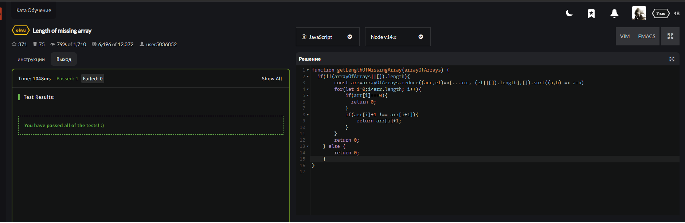
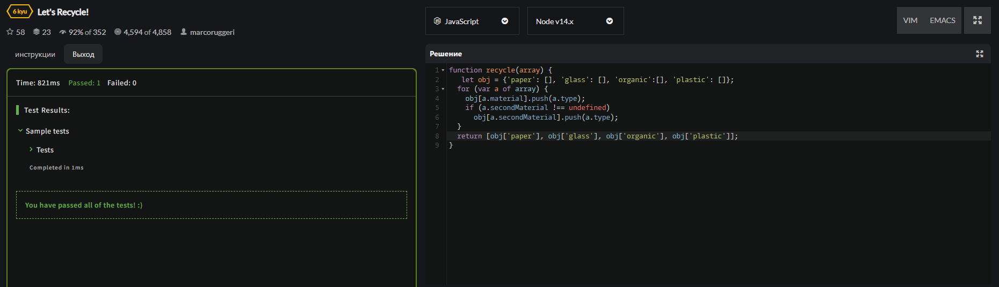
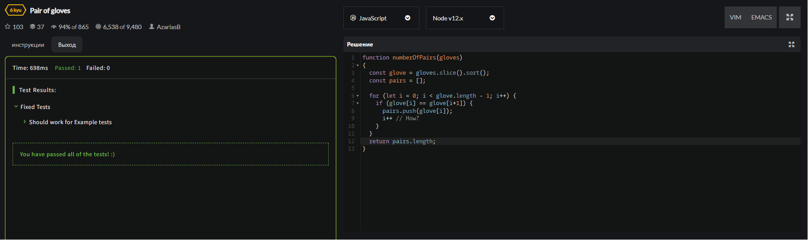
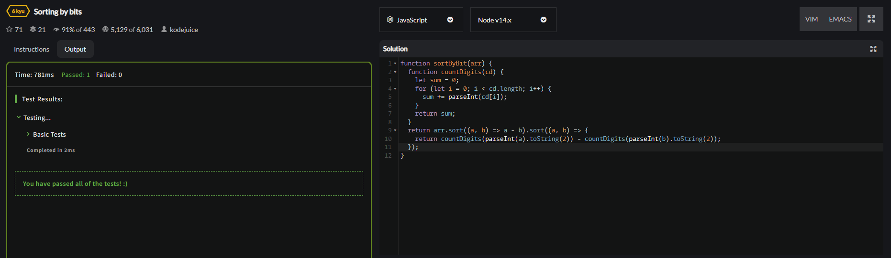

<p align = "center">МИНИСТЕРСТВО НАУКИ И ВЫСШЕГО ОБРАЗОВАНИЯ
РОССИЙСКОЙ ФЕДЕРАЦИИ
ФЕДЕРАЛЬНОЕ ГОСУДАРСТВЕННОЕ БЮДЖЕТНОЕ
ОБРАЗОВАТЕЛЬНОЕ УЧРЕЖДЕНИЕ ВЫСШЕГО ОБРАЗОВАНИЯ
«САХАЛИНСКИЙ ГОСУДАРСТВЕННЫЙ УНИВЕРСИТЕТ»</p>
<br>
<p align = "center">Институт естественных наук и техносферной безопасности</p>
<p align = "center">Кафедра информатики</p>
<p align = "center">Пашаян Самвел Алексанович</p>
<br>
<p align = "center">Лабораторная работа №4</p>
<p align = "center">01.03.02 Прикладная математика и информатика</p>
<br>
<p align = "right" >Научный руководитель</p>
<p align = "right" >Соболев Евгений Игоревич</p>
<p align = "center" >Южно-Сахалинск</p>
<p align = "center" >2022 г.</p>
<p align = "center" ><b>ВВЕДЕНИЕ</b></p>
<p> <b> JavaScript </b> — это язык программирования, который используют для написания frontend- и backend-частей сайтов, а также мобильных приложений. Часто в текстах и обучающих материалах название языка сокращают до JS. Это язык программирования высокого уровня, то есть код на нем понятный и хорошо читается.</p>
<p> JavaScript обычно используется как встраиваемый язык для программного доступа к объектам приложений. Наиболее широкое применение находит в браузерах как язык сценариев для придания интерактивности веб-страницам, для этого даже не требуется компиляция (перевод языка программирования в машинный код). Скрипты можно прописать внутри кода страницы или подключить к HTML отдельным файлом. 
Основные архитектурные черты: динамическая типизация, слабая типизация, автоматическое управление памятью, прототипное программирование, функции как объекты первого класса.</p>
<p align = "center" > РЕШЕНИЕ ЗАДАЧ (ОСНОВНАЯ ЧАСТЬ) </p>

```js 

    function z1(){
        idfirst.innerHTML=yfirst(1.5);
    }

    function yfirst(x){
        if(x>0){
            return Math.pow(Math.sin(x),2)
        }
        else{
            return 1-2*Math.pow(Math.sin(x),2)
        }
    }

    function z2(){
        let str="0332";
        let bool=true;
        for (let i = 0; i <str.length/2; i++) {
        let n=str.length-i-1;
        if(str[i]!=str[n]){
            bool=false;
            break;
        }
        }
        idfirst.innerHTML=str+" palindrom its "+bool;
    }

    function z3(){
        let year=prompt("Введите год");
        idfirst.innerHTML=year+" год високосный?  : "+leap_year(year);
    }

    function leap_year(year){
        if(year%100==0){
            if(year%4==0 && year%400==0){
                return "Yes"
            }
            else{
                return "No"
            }
        }
        if(year%4==0){
            return "Yes"
            }
        else{
                return "No"
        }
    }

    function z4(){
        idfirst.innerHTML=ysecond(-1);
    }

    function ysecond(x){
        if(x==-1){
            return 1
        }
        else if(x<-1){
            return -1
        }
        else if(x>-1){
            return x
        }
    }
    function z5(){
        let month=prompt('Введите месяц');
        switch(month){
            case "декабрь":
            case "январь":
            case "февраль":
                idfirst.innerHTML=month+"-Это зима"
                break;
            case "март":
            case "апрель":
            case "май":
                    idfirst.innerHTML=month+"-Это весна"
                    break;
            case "июнь":
            case "июль":
            case "август":
                    idfirst.innerHTML=month+"-Это лето"
                    break;
            case "сентябрь":
            case "октябрь":
            case "ноябрь":
                    idfirst.innerHTML=month+"-Это осень"
                    break;

        }
    }

    function z6(){
        let m=prompt("Введите масть карты 1-4");
        let k=prompt("Введите номер карты 6-14");
        let s1,s2;
        switch(m){
            case "1": s1="Пик"
            break;
            case "2": s1="Треф"
            break;
            case "3": s1="Буби"
            break;
            case "4": s1="Черви"
            break;
        }
        switch(k){
            case "6": s2="Шестерка"
            break;
            case "7": s2="Семерка"
            break;
            case "8": s2="Восьмерка"
            break;
            case "9": s2="Девятка"
            break;
            case "10": s2="Дестяка"
            break;
            case "11": s2="Валет"
            break;
            case "12": s2="Дама"
            break;
            case "13": s2="Король"
            break;
            case "14": s2="Туз"
            break;
        }
        idfirst.innerHTML=s2+" "+s1;

    }

    function z7(){
        let year=prompt("Введите год");
        let year2=year%12;
        let year3=year%10;
        let color;
        let animal="";
        switch(year2){
            case 4: animal="крыса"
            break;
            case 5: animal="корова"
            break;
            case 6: animal="тигр"
            break;
            case 7: animal="заяц"
            break;
            case 8: animal="дракон"
            break;
            case 9: animal="змея"
            break;
            case 10: animal="лошадь"
            break;
            case 11: animal="овца"
            break;
            case 0: animal="обезьяна"
            break;
            case 1: animal="петух"
            break;
            case 2: animal="собака"
            break;
            case 3: animal="свинья"
            break;
        }
        switch(year3){
            case 0:
            case 1:
                color="Белый";
                break;
            case 2:
            case 3:
                color="Черный";
                break;
            case 4:
            case 5:
                color="Зеленый";
                break;
            case 6:
            case 7:
                color="Красный";
                break;
            case 8:
            case 9:
                color="Желтый";
                break;
        }
        idfirst.innerHTML=color+" "+animal;

    }

    function z8(){
        var i , j;
        let result='';
        for(i = 1;i <= 9;i ++){
            for(j = 1;j <= i;j ++){
                sum = i * j;
                result+=i+ "*"+ j+ "="+sum+" "; 
            }
            result+="<br>"
        }
        idfirst.innerHTML=result;
    }

    function z9(){
        idfirst.innerHTML="";
        for (let i = 2; i < 21; i++) {
            idfirst.innerHTML+="Sin "+i +" = "+Math.sin(i)+"<br>";  
        }

    }

    function task10(){
        let resulta=0;
        for (let i = 100; i < 501; i++) {
            resulta+=i;
        }
        idfirst.innerHTML="Сумма от 100 до 500"+resulta;
    }

    function z11(){
        let n=100;
        let result=0;
        for (let i = 1; i <= n; ++i){
            result+=1/i
        }
        idfirst.innerHTML=result;
    }
    function z12(){
        let x=5;
        let y =7;
        let result=0;
        for (let i = 0; i < y; ++i){
            result+=x
        }
        idfirst.innerHTML=result;
    }
    function z13(){
        let n=12;
        let result=0;
        for (let i = 1; i <= n; ++i){
            result+=2*i-1;
        }
        idfirst.innerHTML=result;
    }

    function z14(){
        let result=0;
        for (let i = 1; i <= 50; ++i){
            result+=Math.sqrt(i);
        }
        idfirst.innerHTML=result;
    }

    function z15(){
        let array=[12,4,15,-1,0];
        let count=0;
        let sum=0;
        array.forEach(element => {
            if(element==0){
                return;
            }
            sum+=element;
            count++;
        });
        idfirst.innerHTML="Summ = "+sum+" Count = "+count;

    }

    function z16(){
        let array=[12,4,15,-1,0];
        let count=0;
        let sum=0;
        array.forEach(element => {
            if(element<0){
                return;
            }
            sum+=element;
            count++;
        });
        idfirst.innerHTML="Среднее арифметическое = "+sum/count;

    }

    function z17(){
        
        let number = 503245;
        let array = Array.from(number.toString(), Number)
        let count=0;
        idfirst.innerHTML="";
        for (let i = 0; i < array.length; i++) {
            if(array[i]==3){
                count++;
            }
        }
        idfirst.innerHTML+="В числе"+number+"<br> 3 встречается -" +count+"<br>";
        count=0;
        for (let i = 0; i < array.length; i++) {
            if(array[i]==array[array.length-1]){
                count++;
            }
        }
        idfirst.innerHTML+="последнее число-"+array[array.length-1]+" встречается - "+count+"<br>";

        count=0;
        for (let i = 0; i < array.length; i++) {
            if(array[i]%2==0){
                count++;
            }
        }
        idfirst.innerHTML+="Четных-"+count+"<br>";

    }
    function z18(){
        let number = 1293408;
        let array = Array.from(number.toString(), Number)
        let min=10;
        let max=0;
        let maxc;
        let minc;
        for (let i = 0; i < array.length; i++) {
            if(array[i]>max){
                max=array[i];
                maxc=i+1;
            }
            if(array[i]<min){
                min=array[i];
                minc=i+1;
            }
        }
        idfirst.innerHTML="Число "+number+"<br>Минимальное - "+min+" на месте "+minc+"<br>Максимальное - "+max+" на месте "+maxc;
    }

    function z19(){
        idfirst.innerHTML=isPrime(5);
    }

    function isPrime(num) {
        for (let i = 2; i < num; i++) {
        if (num % i === 0) {
            return false;
        }
        }
        return num > 1;
    }

    function z20(){
        idfirst.innerHTML=allplus(1478);
        idfirst.innerHTML+="<br>"+allplus(1782);
        idfirst.innerHTML+="<br>"+allplus(1668);
    }

    function allplus(num){
        let array = Array.from(num.toString(), Number)
        for (let i = 1; i < array.length; i++) {
            if(array[i]<=array[i-1]){
                return false;
            }
        }
        return true;
    }

    function z21(){
        let array=[12,14,15,200,677,4300,7799,9999,10000];
        let n=8000;
        idfirst.innerHTML=array+"<br>";
        for (let i = 0; i < array.length; i++) {
            if(array[i]>10000){
                idfirst.innerHTML+="Числа больше "+n+" нету";
                return;
            }
            if(array[i]>n){
                i++;
                idfirst.innerHTML+="Номер элемента больше "+n+" - "+i;
                return;
            }
            
        }

    }

    function z22(){
        idfirst.innerHTML=banda(5556,6,5);
    }

    function banda(number,a,b){
        let array = Array.from(number.toString(), Number)
        let counta=0;
        let countb=0;
        array.forEach(element => {
            if(element==a){
                counta++;
            }
            if(element==b){
                countb++;
            }
        });
        return countb>counta;
    }

    function z23(){
        idfirst.innerHTML="";
        let i=10;
        while(i<31){
            idfirst.innerHTML+=i+"<br>";
            i++;
        }
        idfirst.innerHTML+="Пост условие:<br>"
        let j=10;
        do {
            idfirst.innerHTML+=j+"<br>";
            j++;
        } while (j<31);
    }
```
<p><b>Задачи CodeWars (1)</b></p>

<p><b>Задачи CodeWars (2)</b></p>

<p><b>Задачи CodeWars (3)</b></p>

<p><b>Задачи CodeWars (4)</b></p>


<p align = "center" > ВЫВОД </p>
<p> Итогом работы стало создание странички с использованием языка JS. В ходе выполнения задания, мною были решены все выдвинутые задачи, сформулированные исходя из цели лабораторной работы, и в которых нужно было написать функции, выполняющие то или иное действие при помощи различного применения циклов и условий. Это позволяет сделать вывод, что цель данной лабораторной работы успешно достигнута. </p>
